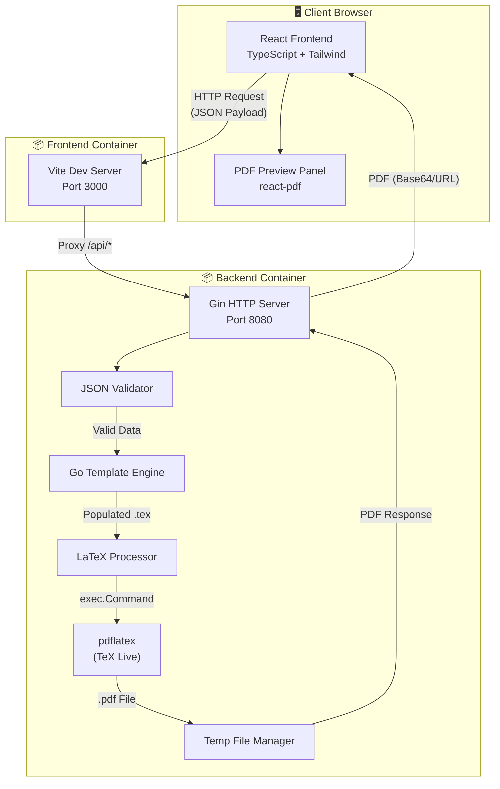
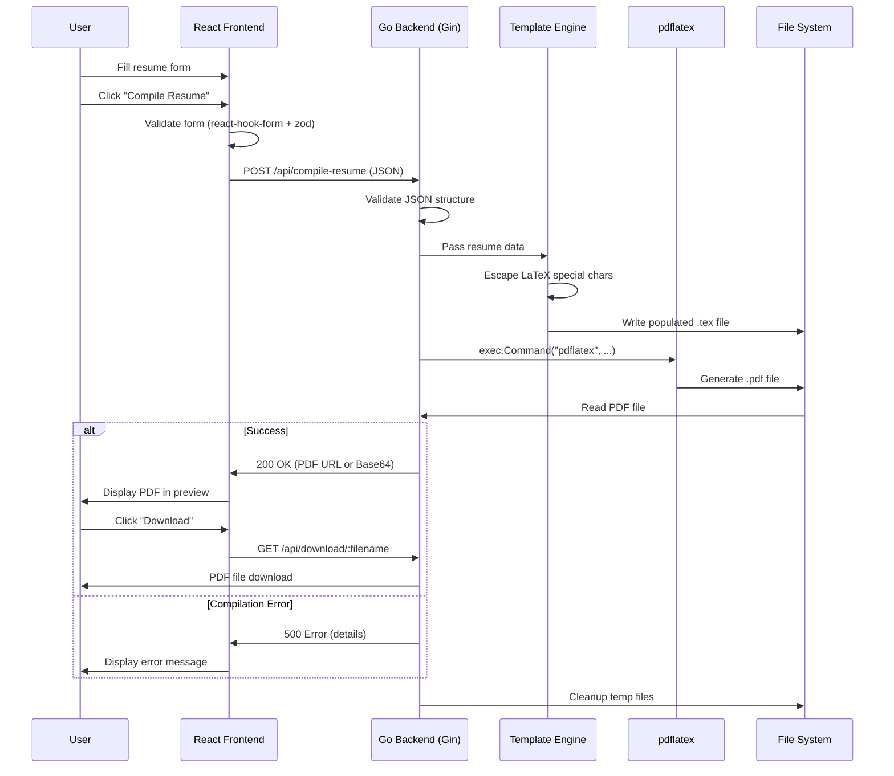
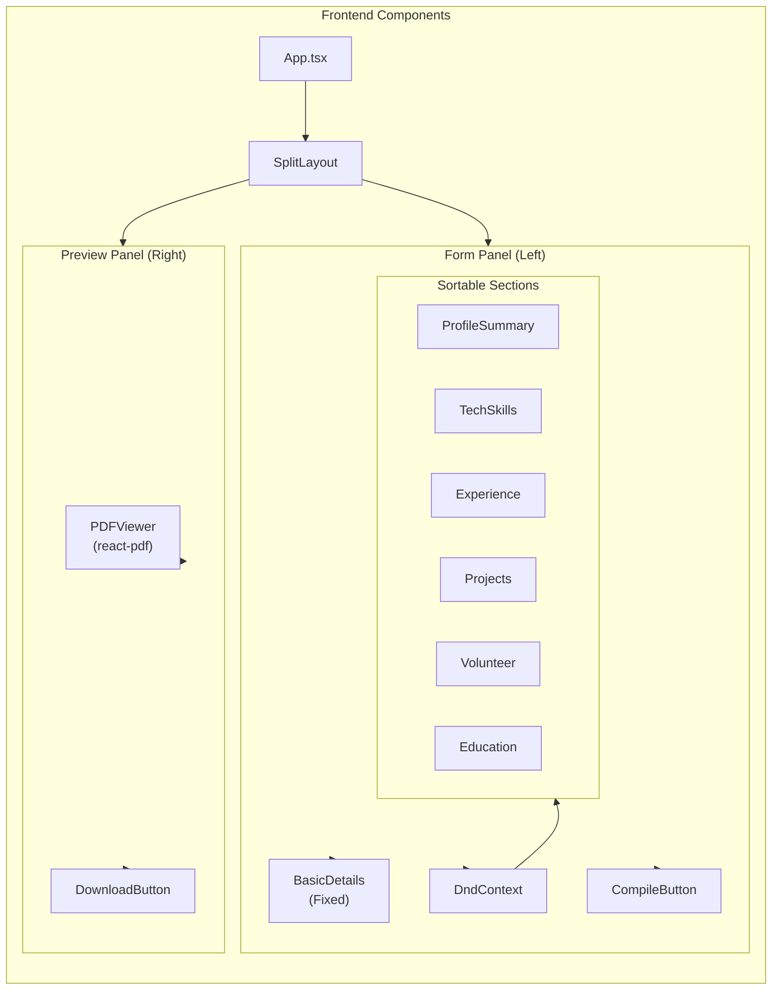
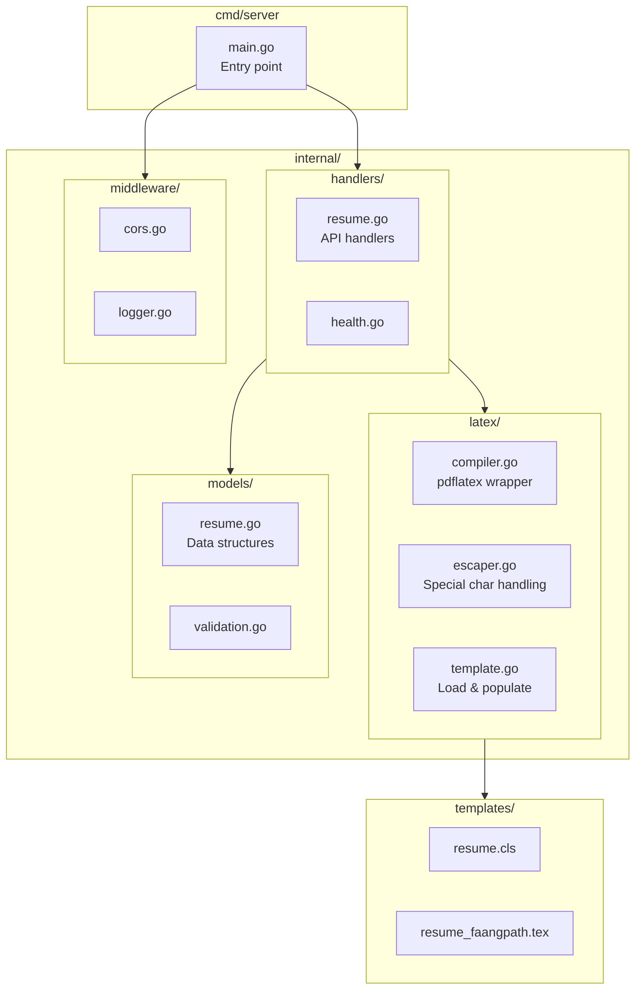
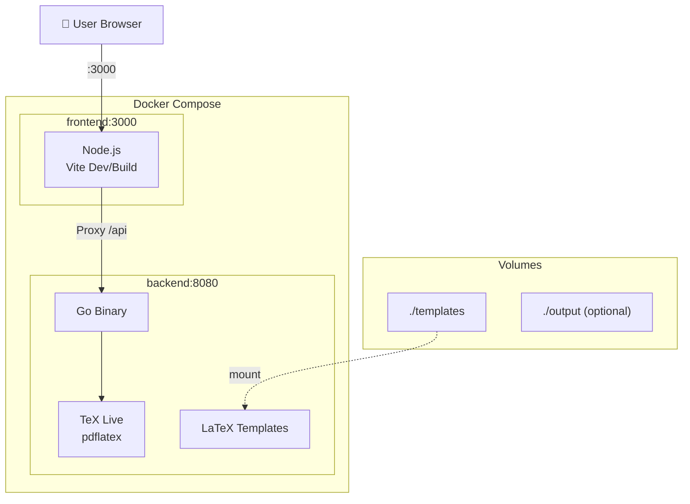
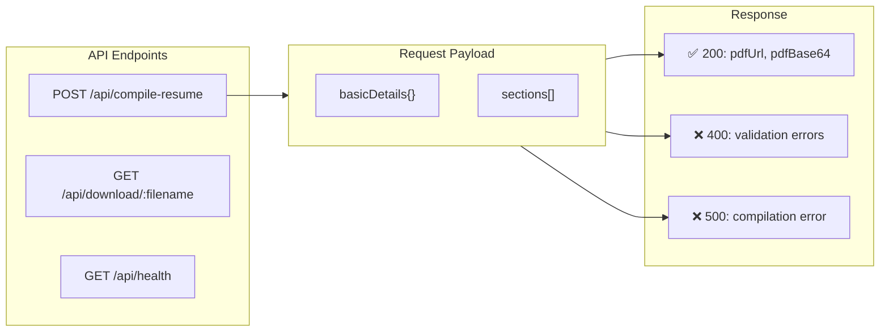

# ATS Resume Builder - Architecture Document

## System Architecture Diagram



---

## Data Flow Architecture



---

## Component Architecture



---

## Backend Module Architecture



---

## Deployment Architecture



---

## API Architecture



---

## File Structure

```
ats-resume-maker/
├── 📁 frontend/
│   ├── 📁 src/
│   │   ├── 📁 components/
│   │   │   ├── 📁 sections/
│   │   │   │   ├── BasicDetails.tsx
│   │   │   │   ├── ProfileSummary.tsx
│   │   │   │   ├── TechSkills.tsx
│   │   │   │   ├── Experience.tsx
│   │   │   │   ├── Projects.tsx
│   │   │   │   ├── Volunteer.tsx
│   │   │   │   └── Education.tsx
│   │   │   ├── 📁 layout/
│   │   │   │   ├── SplitLayout.tsx
│   │   │   │   └── DraggableSection.tsx
│   │   │   └── 📁 preview/
│   │   │       └── PDFPreview.tsx
│   │   ├── 📁 hooks/
│   │   │   ├── useResumeForm.ts
│   │   │   └── usePdfCompile.ts
│   │   ├── 📁 types/
│   │   │   └── resume.ts
│   │   ├── 📁 utils/
│   │   │   └── api.ts
│   │   ├── App.tsx
│   │   ├── main.tsx
│   │   └── index.css
│   ├── package.json
│   ├── tsconfig.json
│   ├── tailwind.config.js
│   └── vite.config.ts
│
├── 📁 backend/
│   ├── 📁 cmd/
│   │   └── 📁 server/
│   │       └── main.go
│   ├── 📁 internal/
│   │   ├── 📁 handlers/
│   │   │   ├── resume.go
│   │   │   └── health.go
│   │   ├── 📁 latex/
│   │   │   ├── compiler.go
│   │   │   ├── escaper.go
│   │   │   └── template.go
│   │   ├── 📁 models/
│   │   │   ├── resume.go
│   │   │   └── response.go
│   │   └── 📁 middleware/
│   │       └── cors.go
│   ├── 📁 templates/
│   │   ├── resume.cls
│   │   └── resume_faangpath.tex
│   ├── go.mod
│   ├── go.sum
│   └── Dockerfile
│
├── 📁 docs/
│   ├── REQUIREMENTS.md
│   ├── TECHNICAL_SPEC.md
│   └── ARCHITECTURE.md
│
├── docker-compose.yml
└── README.md
```
